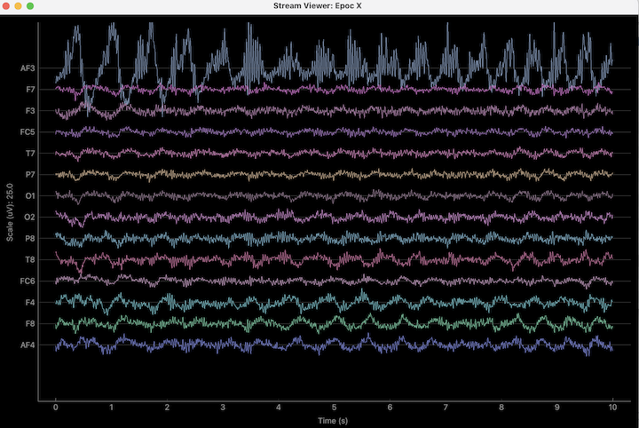

# emotiv-lsl

LSL server for Emotiv EPOC X  
Original code taken from [CyKit](https://github.com/CymatiCorp/CyKit)

### Dependencies

```
pip install pipenv
python -m pipenv install
```

### Usage
Disable the motion data in Emotiv app settings  
Connect dongle, turn on the headset, wait for the light from two indicators
```
# frist terminal
python -m pipenv run python main.py
```

Then you can use any lsl client, for example [bskl](https://github.com/bsl-tools/bsl)

```
bsl_stream_viewer
```



Or use examples/read_data.py to get raw data

```
# second terminal
python -m pipenv run python examples/read_data.py
```

### Cortex quality streams to LSL

If you have a working Cortex app key, this repo can also bridge the Cortex `dev`
(contact quality) and `eq` (EEG quality) streams into LSL without changing the
raw HID EEG path.

Set your Cortex credentials:

```bash
export EMOTIV_CLIENT_ID=your_client_id
export EMOTIV_CLIENT_SECRET=your_client_secret
```

Then run:

```bash
python -m pipenv run python main_cortex.py --print-samples
```

This opens two additional LSL outlets when Cortex allows them:

* `Epoc X Contact Quality`
* `Epoc X EEG Quality`

Notes:

* You must be logged into EMOTIV Launcher on the same machine.
* The app must be approved in EMOTIV Launcher.
* This bridge uses Cortex over `wss://localhost:6868`.
* It opens a Cortex session in `open` mode, not `active`, because the goal here
  is to test `dev` and `eq`, not licensed raw EEG via Cortex.

### Config

Change device sampling rate in config.py and emotiv app

### Probe hidden quality fields

This repo currently publishes only the 14 EEG channels. The decrypted packet also
contains four non-EEG bytes that are not exposed by default. To inspect whether
they carry useful quality information without breaking existing EEG consumers:

```bash
python -m pipenv run python main.py --emit-debug --log-decrypted data/decrypted_packets.csv
```

This keeps the existing `EEG` outlet and adds a second stream named `Epoc X Debug`
with four channels:

* `COUNTER`
* `DATA_MODE`
* `BYTE16`
* `BYTE17`

Suggested test protocol:

1. Start the EEG and debug outlets.
2. Record both in LabRecorder.
3. Put the headset on with a good fit, then intentionally worsen one sensor at a time.
4. Check whether `BYTE16` or `BYTE17` changes systematically with global fit.
5. If you have temporary EmotivPro access on one machine, compare the debug stream
   against its `Contact-Quality` output once to correlate any hidden fields.

If these bytes do not track contact quality, the next step is to treat true contact
quality as unavailable on the HID path and implement a separate signal-quality proxy
instead of calling it contact quality.

### Examples

Get raw data:

```
python main.py & # start lsl server
python examples/read_data.py # get raw data
[4179.35888671875, 4320.5126953125, 4263.84619140625, 4311.53857421875, 4393.58984375, 4347.56396484375, 4371.41015625, 4549.4873046875, 4511.9228515625, 4434.1025390625, 4378.46142578125, 5053.33349609375, 4283.33349609375, 4228.46142578125] 104573.455064594
[4163.33349609375, 4318.0771484375, 4258.7177734375, 4310.384765625, 4396.41015625, 4350.384765625, 4374.615234375, 4550.76904296875, 4508.0771484375, 4429.4873046875, 4374.4873046875, 5058.205078125, 4274.4873046875, 4222.94873046875] 104573.457074205
[4164.615234375, 4316.02587890625, 4255.384765625, 4312.3076171875, 4398.0771484375, 4350.12841796875, 4376.15380859375, 4552.94873046875, 4513.97412109375, 4430.8974609375, 4375.384765625, 5063.7177734375, 4275.384765625, 4225.0] 104573.464060118
[4177.94873046875, 4321.66650390625, 4261.794921875, 4313.46142578125, 4397.1796875, 4347.05126953125, 4373.58984375, 4551.66650390625, 4521.2822265625, 4436.794921875, 4378.7177734375, 5060.76904296875, 4283.7177734375, 4232.8203125] 104573.472085895
```

Write raw data via mne to .fif:

```
python main.py & # start lsl server
python examples/read_and_export_mne.py # write raw data to fif file
Ready.
Writing emotiv-lsl/data_2023-09-20 18:36:10.775860_raw.fif
Closing emotiv-lsl/data_2023-09-20 18:36:10.775860_raw.fif
```
